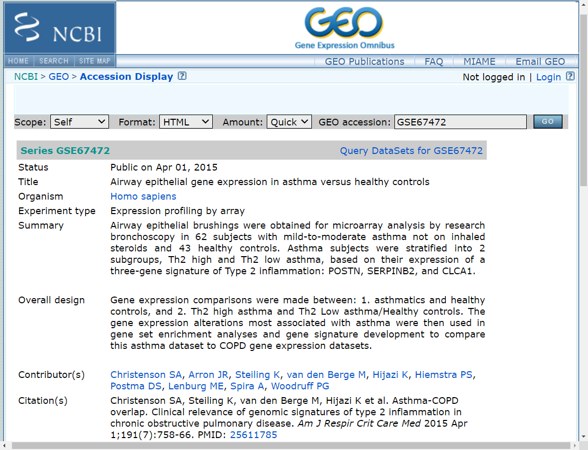

```{r setup, include=FALSE}
knitr::opts_chunk$set(echo = TRUE, cache = TRUE, dpi=300)
```

```{r klippy, echo=FALSE, include=TRUE}
klippy::klippy()
```

## Before you begin

### Download R and RStudio 

`r emo::ji("alarm")` timing: 1 hour 

1. R is a free software environment for statistical computing and graphics. It runs on UNIX, Windows and MacOS. 

- To download and install R go to https://www.r-project.org/ (R Core Team, 2013). The current pipeline was performed using R version 4.2.2.

2. RStudio is an integrated development environment (IDE) for R. It allows to easily execute the R codes, plot graphics, and manage the workspace in a multipanel interphase. 

- To download and install RStudio go to https://rstudio.com/products/rstudio/ (RStudio Team, 2020).

### Download required packages

`r emo::ji("alarm")` timing: 1 hour 

3. Users must first download the required packages (listed in the key resources table). They can be downloaded through Bioconductor, which provides tools for the analysis and comprehension of high-throughput genomic data. BiocManager::install() is the recommended command to install packages (for detailed information on why BiocManager::install() is preferred to the standard R packages installation please read https://www.bioconductor.org/install/#whybiocmanagerinstall):

- Open RStudio, and set up the working directory. Here, you may select a specific directory path, such as my dir path "F:/advbioinfor_test/lecture_03".

```{r class.source="bg-success"}
setwd("F:/advbioinfor_test/lecture_03")
dir.create("data") # construct a new file dir.
```

- Install the packages needed for the analysis. 

```{r message=FALSE, warning=FALSE, class.source="bg-success"}
if (!requireNamespace("BiocManager", quietly = TRUE))
install.packages("BiocManager") 

pkgs <- c("GEOquery", "affy", "simpleaffy")

for (p in pkgs) {
  if (!requireNamespace(p, quietly = TRUE))
BiocManager::install(p) 
}
```
- Once all packages are installed, they need to be loaded:

```{r df-drop-ok, class.source="bg-success"}
library(GEOquery)
library(affy)
library(simpleaffy)
```

### Dataset selection
`r emo::ji("alarm")` timing: 2 days

4. When using datasets from public repositories, the key step is to identify a dataset (or datasets) that comply with the eligibility criteria and that contains the sample information required for the analysis. 

- We suggest browsing Gene Expression Omnibus (GEO: https://www.ncbi.nlm.nih.gov/gds, (Barrett et al., 2012)) and ArrayExpress (https://www.ebi.ac.uk/arrayexpress/, (Athar et al., 2019)) repositories because they gathermultiple high-throughput genomics datasets.

- In this project, publicly available microarray gene expression datasets for asthma were retrieved from the Gene Expression Omnibus Database (GEO) (http://www.ncbi.nlm.nih.gov/geo/) using the keyword “asthma”. The raw datasets were manually checked and only those met the following criteria were included for subsequent analysis: 1) gene expression profiling in asthmatics and controls, 2) cell type: airway epithelial cell, but not nasal epithelium, 3) gene expression data were generated by a single-channel microarray platform (Affymetrix or Agilent chips), 4) availability of raw CEL or TXT files, 5) samples with detailed descriptions, and 6) sample size > 80.  

- According to above-mentioned criterion, two datasets were identified, including GSE63142 and GSE67472. Next, We will demonstrate how to conduct data analysis for Affymetrix DNA microarray (*i. e.* GSE67472). 



## Materials & Equipment

For this bioinformatics analysis we used a laptop with an Intel Core i5 8th generation processor, 32 GB RAM memory and Windows 10 Pro. No high-performance computing clusters were needed for the analysis of the data. Internet connection is required for downloading R packages and data matrixes. 

$$
\sigma = \sqrt{ \frac{1}{N} \sum_{i=1}^N (x_i -\mu)^2}
$$
## Step-by-step Methods

The flow chart for data processing is included in Figure 1. 


### Download and prepare the data matrix for analysis

`r emo::ji("alarm")` timing: 2 hours 

### RNA-seq data organization and count normalization

`r emo::ji("alarm")` timing: 1 hour 

### Differential gene expression analysis across different strata

`r emo::ji("alarm")` timing: 1 day 

### Correlation analysis

`r emo::ji("alarm")` timing: 1 day 

### Patient segregation based on gene expression

`r emo::ji("alarm")` timing: 1 day 

<div class="alert alert-danger" role="alert">
  **Warning:** This is a danger alert—check it out!
</div>

## About Statistical Analysis

Eligibility criteria, statistical tests and software used for this protocol are properly described in the ‘‘before you begin’’ and ‘‘step-by-step methods details’’ sections.

## Reference 

`r emo::ji("paper")` Nie X, Wei J, Hao Y, *et al*. Consistent biomarkers and related pathogenesis underlying asthma revealed by systems biology approach[J]. *International journal of molecular sciences*, 2019, 20(16): 4037. 
