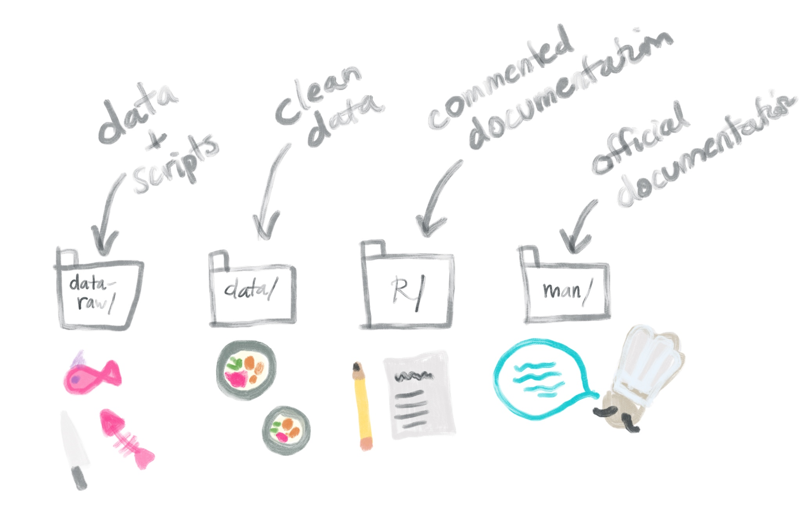
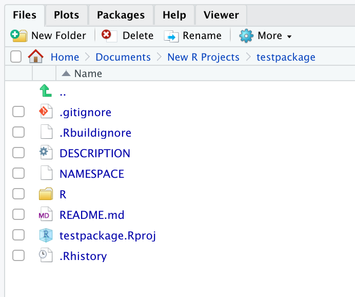
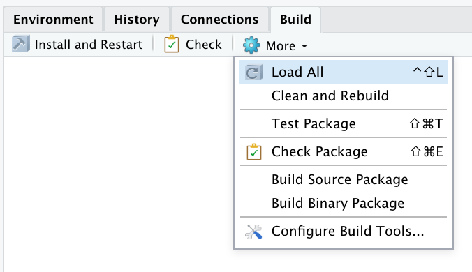
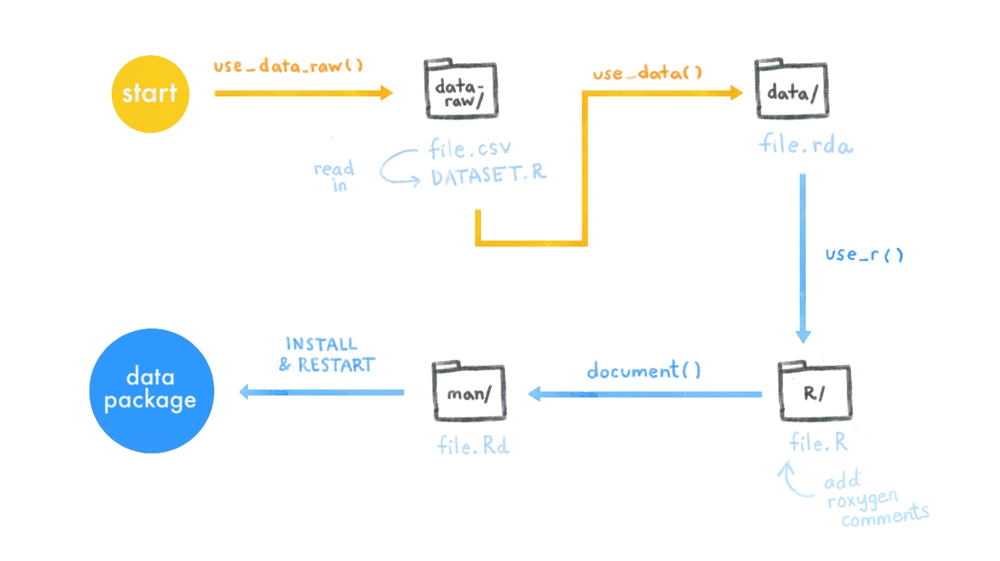

# Create a data package {#data-pkg}


This tutorial is intended for educators who would like to learn to make a data package.

<center>{width=350px}</center>


**Why do this?**

What if you'd like your students to work with a specific data set? Should you email them an excel or .csv file or upload it onto an oustide learning platform? No! You can include data sets in your package, ready to be summoned with the call of an object name. This saves precious instruction time that might otherwise be wasted and also helps students get to the fun stuff (analysis!) faster.


## Is this tutorial for you?


**Pre-requisites:**

* You have a [GitHub account](https://github.com/)
* You are comfortable with the basics of using R and RStudio
* You understand how R projects work
* You understand the difference between a regular R script and an R Markdown document


**What you'll learn:**

* How to make a package that your students can download and install from GitHub
* How to tidy up an existing dataset and put it in a package
* How to include a raw data set in your package

## Mental Framework

What are we going to make here?

To create a package with data that is ready for our learners, we're going to make four new folders that will contain (1) our raw data files, (2) any scripts for cleaning up our data, (3) commented documentation of our data, and (4) cleaned up documentation of our data. Finally, we'll pull it all together when we (5) build all of these things into our package. 

We can think of this process of putting data in a package as kind of like getting a fish ready to be used in a sushi roll at a nice restaurant. 

<center>{width=600px}</center>

\

🎣 `data_raw/`: this is your fish

🍣 `data/`: this is your sushi roll (re: some additional data prep here like wrangling, and final object gets "rolled up" into a nice clean .rda file)

📝 `R/`: write up your menu- what is inside of your roll?

🍱 `man/`: this is the chef giving you the tableside context for what you've ordered and what it pairs well with


Let's go through this process!


## Part 1: Getting set up

### Packages

Make sure you've installed and loaded the following packages:


```r
#install.packages(c("usethis", "devtools", "roxygen2"))
library(devtools)
library(roxygen2)
library(devtools)
```

You may also want to consider installing and loading `here::here()`:


```r
# install.packages("here")
# here::here()
```

### Two getting-started workflows

Our final goal is to create a package that is "downloadable" by your students, which means this package needs to have a GitHub repository so that it can be easily shared. See our tips below for what to name your project repository.

:::tip
**What's in a name?** Name your GitHub repository whatever you want to name your data package. It will make things less confusing. As such, the name you choose must:

* Include only letters, numbers, or `.`
* Start with a letter
* Not end with a `.` 
* Optionally, consider the naming tips **[here](https://r-pkgs.org/package-structure.html)**
:::

:::rstudio-tip
**Where to put this project directory?** Make sure your project directory that we will use to make this package is not nested within any other projects, folders, or repos. It should be its own thing.
:::


We recommend following the tips on [Happy Git with R](https://happygitwithr.com/new-github-first.html) and starting in GitHub before switching to RStudio:

1. [**Create a new repository on GitHub**](https://happygitwithr.com/new-github-first.html#make-a-repo-on-github-2) for your work. 

    + Do *not* initialize the repo with a `.gitignore` or a `README` file (we'll add these later!).  
<br>
1. **Copy the repository URL** to your clipboard. 

    + Do this by clicking the green Clone or Download button.
    
    + Copy the HTTPS clone URL (looks like: `https://github.com/{yourname}/{yourrepo}.git`).
    
    + **Or** copy the SSH URL if you chose to set up SSH keys (looks like: `git@github.com:{yourname}/{yourrepo}.git`).  
<br> 
1. [Create a new RStudio Project via git clone](https://happygitwithr.com/new-github-first.html#new-rstudio-project-via-git-clone). **Open RStudio.** 

    + Do this by clicking *File* > *New Project* > *Version Control*> *Git*. 
    
    + Paste the copied URL. 
    
    + Be intentional about where you tell RStudio to create this new Project.  
<br>
1. **Click Create Project.**

:::tip
Follow these instructions from [Happy Git with R](https://happygitwithr.com/) to start with a new repo on [GitLab](https://happygitwithr.com/new-github-first.html#gitlab) or [Bitbucket](https://happygitwithr.com/new-github-first.html#bitbucket), instead of GitHub.
:::


```r
create_package(getwd())
```


The console output will ask if you'd like to overwrite the pre-existing R project. Select *No*. 

<center> {width=400px}</center>


A second session of RStudio will open -- this ession has a *Build* tab in the pane which also has the tabs *Environment*, *History*, etc. This tab is specific for building packages, and we will use it later. You can close the other RStudio instance.

<center> {width=500px} </center>


It is a good idea to commit to GitHub at this point. 

\
Though we don't recommend starting this way, it is possible to first make a data package project in RStudio and then connect it to GitHub afterwards.

1.  Click *File* > *New Project* > *New Directory*
1.  Scroll down and select *R Package*
1.  Select a package name (see tip above) and click *Create Project*
1.  Then, optionally:


```r
usethis::use_git()
usethis::use_github() # you have to have a PAT setup
```

\
Regardless of which workflow you choose, your project directory should end up looking like this:

<center>{width=400px}</center>

We have a few package-specific files set up now-- in our sushi analogy, this is like us purchasing an empty restaurant-- some infrastructure is there, but there's nothing in the kitchen yet!

<center>{width=400px}</center>
 
 
## Part 2: Add some clean data

### With built-in data
Let's say we want our learners to be able use a [built-in dataset](https://stat.ethz.ch/R-manual/R-devel/library/datasets/html/00Index.html) like [`anscombe`](https://stat.ethz.ch/R-manual/R-devel/library/datasets/html/anscombe.html), but we'd like to modify it first. Any clean up `.R` scripts or miscellaneous files that we use for pre-processing will need a place to live within our package. Where do these files go? In a folder called `data-raw/`. 

1.  Let's create the `data-raw/` folder:


```r
usethis::use_data_raw()
```

[commit]

The `data-raw/` folder is like the pantry (?) of our sushi restaurant-- we can put anything we want in here, and it won't directly impact our final package.
\

2. Go to *File* > *New File* > *R Script* and read-in any data set you'd like along with any clean up steps. (Alternatively, you could add your clean-up script to the `DATASET.R` that gets auto-generated inside of the `data-raw/` folder--but we recommend naming your `.R` script to be something that corresponds with the name of your dataset.)


```r
anscombe_set1 <- anscombe[c(1, 5)]
```
This is you bringing in the raw fish (raw data set -- `anscombe`) to the kitchen and getting them ready for consumption!

\

3. At the end of this script, include the following line, replacing `anscombe_set1` with your own cleaned dataset.


```r
use_data(anscombe_set1, overwrite = TRUE)
```
\

4. Run this script and save this `.R` script inside `data-raw/`. The outcome should be a cleaned up `.rda` data file in a new folder called `data/`. 

[commit]

[SCREENSHOT]


This `.rda` file is your (data) sushi roll! It's cleaned and ready to be accessed via your package!

\
5. To confirm this, load your package locally by going to the *Build* pane > Click *More* > *Load All*. 

<center>{width=400px}</center>

This is the same as running `devtools::load_all()` in the console. 

If everything worked, you should be able to call your cleaned data set successfully!
```
> anscombe_set1
   x1    y1
1  10  8.04
2   8  6.95
3  13  7.58
4   9  8.81
5  11  8.33
6  14  9.96
7   6  7.24
8   4  4.26
9  12 10.84
10  7  4.82
11  5  5.68
```

🎉 Nice! With these steps, you've managed to go from raw fish to the packaged-up sushi roll! Wait..but what if you want to catch your OWN fish?? 🎣 We hear you-- using your own data is important as an educator so you can tailor the data to your lesson content --**can you put your own data files in a package? YES!** Let's go fishing!


### Start with your OWN Data

Let's show you how to save your own `.csv` to the `data-raw/` folder. As an example, we'll be using a `shrimp.csv` containing [data on seafood prices](https://www.pnas.org/content/114/7/1512/tab-figures-data). 

\
1. Save your raw `.csv` file to your `data-raw/` folder. (Remember, this folder is our pantry.) 🐟

\
2. Make a new `.R` script (again, manually saving to the `data-raw/ folder`) and name the `.R` script something like `<your-data>_load.R`.

\
3. In this script, read in your raw `.csv` file and do any data tidying and cleaning [analogy: fish chopping block?] if you need to. 

```r
# shrimp_load.R

library(tidyverse)

shrimp_raw <- readr::read_csv("data-raw/shrimp.csv")

# Add any tidying steps to this script if necessary
shrimp <- shrimp_raw[-c(1:2),]
colnames(shrimp) <- c("Year", "Month", shrimp_raw[1,3:10])
shrimp <- readr::type_convert(shrimp)
```

:::tip
Forget about specifying paths-- use `here::here()`. For example:


```r
shrimp <- readr::read_csv(here::here("data-raw", "shrimp.csv"))
```
:::

The `data-raw/` folder gets ignored when we *Build* our package, so you can use whatever packages you'd like to clean and tidy up your data (e.g. `tidyverse`, as I've used above) -- it doesn't affect any of the dependencies for your package because scripts in this folder only get run by you manually.


:::tip
**Note**: It's always a good idea to start with the most unprocessed, messy version of the data `.csv` in the `data-raw/` folder along with scripts to clean it up so that your workflow is reproducible. 
:::


\

4. Once you've got your dataset the way you want it within `<your-data>_load.R`, run `usethis::use_data()` as the last line in the script to export the data as an `.rda` file to the `data/` folder 🍣.

```r
# shrimp_load.R

usethis::use_data(shrimp, overwrite = TRUE)
```

:::tip
**FYI**: The reason .rda (al`so c`alled .RData) `.RData`are use in packaged data sets is because this type of data file format is much faster to read in than `.csv` files.
:::

\
5. Trust but verify that your data set made it in your package by loading the package (*Build* pane > Click *More* > *Load All* or in the console using `devtools::load_all()`). And then call your dataset! 

```
> shrimp
# A tibble: 243 x 10
    Year Month `0-15` `15-20` `20-25` `25-30` `30-40` `40-50` `50-67` Pieces
   <dbl> <dbl>  <dbl>   <dbl>   <dbl>   <dbl>   <dbl>   <dbl>   <dbl>  <dbl>
 1  1990     1   5.76    4.53    3.86    3.51    3.19    2.84    2.54   1.91
 2  1990     2   5.96    4.60    3.90    3.66    3.36    2.93    2.66   1.99
 3  1990     3   6.34    4.75    4.17    3.87    3.56    3.41    3.18   2.46
 4  1990     4   6.06    4.90    4.27    3.97    3.70    3.20    2.91   1.78
 5  1990     5   5.83    4.83    4.46    4.04    3.64    2.96    2.17   1.19
 6  1990     6   5.82    4.79    4.38    3.88    3.27    2.71    2.24   1.45
 7  1990     7   5.92    4.99    4.36    3.54    2.88    2.51    2.17   1.65
 8  1990     8   5.56    4.85    4.27    3.50    2.93    2.45    2.14   1.60
 9  1990     9   5.91    5.00    4.42    3.76    3.14    2.66    2.34   1.75
10  1990    10   6.31    5.30    4.67    4.18    3.45    2.97    2.66   1.96
# … with 233 more rows
```

🎉 It works! 

## Part 3: Check!

Now we can check and see whether there are any issues with our package. 

\
6. In the RStudio *Build* pane > click *Check* (or in the console, run `devtools::check(document=FALSE)`)

```
── R CMD check results ────────────────────────────────────── testpackage 0.0.0.9000 ────
Duration: 7.2s

❯ checking DESCRIPTION meta-information ... WARNING
  Non-standard license specification:
    What license it uses
  Standardizable: FALSE

❯ checking for missing documentation entries ... WARNING
  Undocumented code objects:
    ‘anscombe_set1’ ‘shrimp’
  Undocumented data sets:
    ‘anscombe_set1’ ‘shrimp’
  All user-level objects in a package should have documentation entries.
  See chapter ‘Writing R documentation files’ in the ‘Writing R
  Extensions’ manual.

❯ checking data for ASCII and uncompressed saves ... WARNING
    Warning: package needs dependence on R (>= 2.10)

0 errors ✔ | 3 warnings ✖ | 0 notes ✔
```

This spits back a lot of output, including some warnings! But don't feel overwhelmed. This is okay and is only happening because we have not documented anything in our package yet (our sushi 🍣 is made, but the menu 📝 is not!) --and in fact, if we wanted to, we could still use this package despite the warnings and commit/push to GitHub as is. 

You should document your data sets anyway because it will save you time and help your learners if they're able to use `?dataset` to see all get information about what's inside.

## Part 4: Document the datasets

We'll go through an example of documenting our `shrimp` dataset, but you can (and should) do this for any data set in your package. 

\
7. In the console, run `usethis::use_r()` with your data set name in quotes, which will generate a new `.R` script that lives in an `R/` folder. 


```r
usethis::use_r("shrimp")
```

\
8. In this new `.R` script, type the name of your dataset in quotes. Immediately above this, manually (*yes, manually*) copy and paste-in specially-formatted comments called Roxygen comments (use our example below). These strange-looking comments will eventually become our documentation. 


```r
#' Data of nominal brown shrimp prices by size 
#'
#' Shrimp are classified by size, 0-15 shrimp per pound, 15-20 shrimp per pound, etc. A smaller number per pound indicates larger shrimp. Nominal prices are total monthly value of brown shrimp andings within size class divided by total monthly landings within the size class. 
#'
#' @format A tibble with 243 rows and 10 variables:
#' \describe{
#'   \item{Year}{dbl Year price was recorded}
#'   \item{Month}{dbl Month price was recorded. Ranges from 1-12 for January - December} 
#'   \item{`0-15`}{dbl denoting monthly price for the 0-15/lb. size class}
#'   \item{`15-20`}{dbl denoting monthly price for the 15-20/lb. size class}
#'   \item{`20-25`}{dbl denoting monthly price for the 20-25/lb. size class}
#'   \item{`25-30`}{dbl denoting monthly price for the 25-30/lb. size class}
#'   \item{`30-40`}{dbl denoting monthly price for the 30-40/lb. size class}
#'   \item{`40-50`}{dbl denoting monthly price for the 40-50/lb. size class}
#'   \item{`50-67`}{dbl denoting monthly price for the 50-67/lb. size class}
#'   \item{Pieces}{dbl denoting monthly price of pieces of shrimp totalling a pound}
#' }
#' @source \url{https://www.pnas.org/content/114/7/1512/tab-figures-data}
"shrimp"
```

[commit]

Modify the descriptions to match your dataset. This is you drafting the 📝 menu for your sushi. 

* `@format` describes the dataset basics, including a description of what each of the variables are.
* `@source` should describe where you got this data. Most of the time this is a url, but not nessarily.o

:::tip
**Note:** To read more about Roxygen comments, check out [6.3 Roxygen Comments, R Packages](images/pkg/https://r-pkgs.org/man.html).
:::

\
9. Our 📝 menu is drafted but not yet accessible by the package. In the console, run `devtools::document()` to make the Roxygen comments "concrete". 


```r
devtools::document()
```

This generates a `.Rd` file, that makes our documentation accessible to the package. Our official documentation lives inside a newly-generated `man/` folder. (Think Chef providing a tableside reading of the menu.)

\
10. Try using pulling up your documentation. Call `?shrimp`, substituting the name of your data set. 


```r
?shrimp
```

<center>{width=400px}</center>

If everything looks good, then you're done documenting this dataset! 🎉 If not, keep editing the Roxygen-style comments in the `.R` script and `document()` again until you're satisfied.

Now repeat the steps in this section for any other dataset in your package!


## Part 5: Document the package

11. Now, we'll open up and edit the `DESCRIPTION` file to fill in the author (your) info and other descriptive info about the package.


```
Package: testpackage
Title: Data Package With Shrimp Price Data
Version: 0.0.0.9000
Authors@R: 
    person(given = "Desirée",
           family = "De Leon",
           role = c("aut", "cre"),
           email = "desiree@rstudio.com",
           comment = c(ORCID = "https://orcid.org/0000-1111-2222-3333"))
Description: What the package does (one paragraph).
License: MIT + file LICENSE
Encoding: UTF-8
LazyData: true
RoxygenNote: 6.1.1

```

* You can add your ORCID ID, to the `DESCRIPTION`,  which serves as your authorship fingerprint for creating onlinls. If you don't have one, you can quickly sign up for a free one [here](https://orcid.org/).

* In the License field, we recommend using the MIT license for a package, which you can do by literally typing "MIT + file LICENSE" followed by creating a new text file called "LICENSE" (it has to be named this exactly) in your root project directory with two lines of code for the year and your name. Like so:

```
# LICENSE

YEAR: 2019
COPYRIGHT HOLDER: Desirée De Leon
```

:::tip
**FYI**: To learn more about licensing and why it's important, check out this [resource](https://kbroman.org/pkg_primer/pages/licenses.html).
:::

\
12. Now that all datasets and the `DESCRIPTION` file have been documented. We can check again for any package warnings. Click *Build* > *Check* (or in the console, `devtools::check(document=FALSE)`). This time things should be all-clear!


I happened to get one warning that looked like this:


```r
> checking data for ASCII and uncompressed saves ... WARNING
    Warning: package needs dependence on R (>= 2.10)
```

This means I needed to specify a minimum version of R, which I can do in my DESCRIPTION file, which I edited once more to look like this:  

```
Package: testpackage
Title: Data Package With Shrimp Price Data
Version: 0.0.0.9000
Authors@R: 
    person(given = "Desirée",
           family = "De Leon",
           role = c("aut", "cre"),
           email = "desiree@rstudio.com",
           comment = c(ORCID = "https://orcid.org/0000-1111-2222-3333"))
Description: What the package does (one paragraph).
License: MIT + file LICENSE
Encoding: UTF-8
Depends: R (>= 2.10)
LazyData: true
RoxygenNote: 6.1.1

```
\
* Run *Build* > *Check* one last time -- NOW it's all clear*!

:::tip
If you're still getting *Warnings*, check [here](https://r-pkgs.org/r-cmd-check.html) for some troubleshooting tips. For example, you might get a warning related to your package needing dependence on other packages. You can fix this by running the line below to automatically install any missing or outdated dependencies. 


```r
devtools::install_deps(dependencies = TRUE)
```

:::


\
13. ALMOST THERE! We should also create [documentation for the package overall](https://r-pkgs.org/man.html#man-packages), which is the documentation that we get when we use `?<package-name>`. We add package-level documentation :


```r
usethis::use_package_doc()
```

This creates *one last* (hang in there) *.R* script, carrying the same name as your package. It lives inside the `R/` folder, nextdoor to the Roxygen-commented scripts for each of your datasets. 

* Open this newest `.R` script, and while this script is open, run the following `usethis` code in the console.

```r
usethis::use_tibble()
```

This will make it so that datasets in your package will print out as clean tibbles, instead of dataframes. Your script should look something like this:


```r
#' @keywords internal
"_PACKAGE"

# The following block is used by usethis to automatically manage
# roxygen namespace tags. Modify with care!
## usethis namespace: start
#' @importFrom tibble tibble
## usethis namespace: end
NULL
```

* Run `document()` to make this "concrete", followed by one last *Build* > *Check*.


```r
devtools::document()
```

* Now you can call `?testpackage`, replacing with your own package name. 

[SCREENSHOT]


## Part 6: Build and Install!

<center>{width=350px}</center>

Finally (FINALLY!!) all the pieces of our package are now in place, and it's time to install it. 

\
14. Go to *Build* > *Install and Restart* to make the package "official". Or in the console run:


```r
devtools::install()
```

To celebrate 🎉, let's print out our nice tibble 🦐 `shrimp`:

```
> testpackage::shrimp
# A tibble: 243 x 10
   Year  Month `0-15`      `15-20`     `20-25`     `25-30`     `30-40`     `40-50`     `50-67`     Pieces     
   <chr> <chr> <chr>       <chr>       <chr>       <chr>       <chr>       <chr>       <chr>       <chr>      
 1 1990  1     5.759555465 4.527945872 3.858928071 3.514200832 3.192596609 2.841849966 2.54415628  1.910168236
 2 1990  2     5.962003847 4.601218856 3.90400544  3.660123275 3.359026722 2.925337664 2.661750431 1.992272943
 3 1990  3     6.341150505 4.753105387 4.170154143 3.870107021 3.556246121 3.414308628 3.179252479 2.457202073
 4 1990  4     6.058025577 4.904859873 4.26679422  3.969849673 3.703260885 3.204955068 2.913211903 1.776717746
 5 1990  5     5.827911652 4.830152374 4.464854478 4.041919716 3.637094201 2.961828687 2.17059349  1.188236536
 6 1990  6     5.818761292 4.788106337 4.382883567 3.879214266 3.270806964 2.712393632 2.239497802 1.450032245
 7 1990  7     5.923164993 4.987179487 4.356993267 3.540394871 2.882228712 2.512950583 2.17032006  1.648464142
 8 1990  8     5.563856926 4.854975559 4.266385694 3.4965833   2.934561646 2.452177137 2.136210905 1.598242815
 9 1990  9     5.912565621 4.998191859 4.416478291 3.758592484 3.140213747 2.660816111 2.337113624 1.745624186
10 1990  10    6.311225952 5.296802562 4.672483114 4.183780113 3.446375802 2.966602596 2.662274751 1.958313571
# … with 233 more rows
> 
```

🦐🎉

\
15. **Push everything to GitHub!!**

## Part 7: Deliver

Anyone can now install your package with the following code, substituting the field in quotes with your own GitHub username and package name:


```r
# install.packages("remotes")
remotes::install_github("rstudio4edu/testpackage")
```


## Caring for your package

### A review

Here's a review of all the data package steps we covered:



[^ADD SUSHI TO THE ABOVE IMAGE]


If you wanted to later to and edit one of your datasets, here's what that workflow would look like:

1. Go into `data-raw/` and edit your `.csv` and the corresponding `dataset_load.R` script for in the `data-raw/` folder.
2. After you've made your changes, make sure you re-run `usethis::use_data(<your-dataset>, overwrite = TRUE)`.
3. If your changes affect the variables you've used, then don't forget to update the corresponding Roxygen-commented `.R` script that lives inside the `R/` folder. Run `document()` to put those changes into effect.
4. Run a *Check* for good measure with `devtools::check(document=FALSE)` and finally...
5. Go to *Build*  > *Install and Restart*. 
6. When your learners re-install the package from GitHub, they'll have all your updates!

### Package accessories

We don't cover it here, but you should know that you can also add a [README](https://r-pkgs.org/whole-game.html#use_readme_rmd), and also [R functions](https://r-pkgs.org/r.html) to your package. You can read more about those things in the [R Packages](https://r-pkgs.org/) book.


## tldr;


Here's how you put custom data in a package:

1. In a GitHub-connected RStudio project, run `create_package(getwd())`
2. `usethis::use_data_raw()` makes `data-raw/`. In here, put your `.csv` and a manually-created `dataset_load.R` script. 
3. In `dataset_load.R`, read in the `.csv` and do data-clean up.
3. Also in `dataset_load.R`, run `usethis::use_data(<your-dataset>, overwrite = TRUE)` to export an `.rda` to `data/`.
4. Run `usethis::use_r("<your-dataset>")`. Manually insert Roxygen comments.
5. Edit `DESCRIPTION`. Include a `LICENSE` file.
6. Run `usethis::use_package_doc()` to document the whole package.
7. Keep the package-level `.R` script open and run `usethis::use_tibble()` for data as tibbles.
8. Run `devtools::document()` to make all documentation concrete.
9. Check your package with `devtools::check(document=FALSE)`.
10. Go to *Build*  > *Install and Restart* !
11. Push to GitHub and have folks install with `remotes::install_github("<your-repo>/<your package>")`.


**Congratulations**, you've made a package with documented data! If you'd like to create a worksheet-like templates to also put in your package, continue with the next section. 

