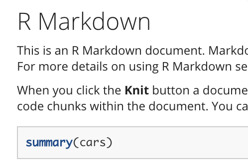
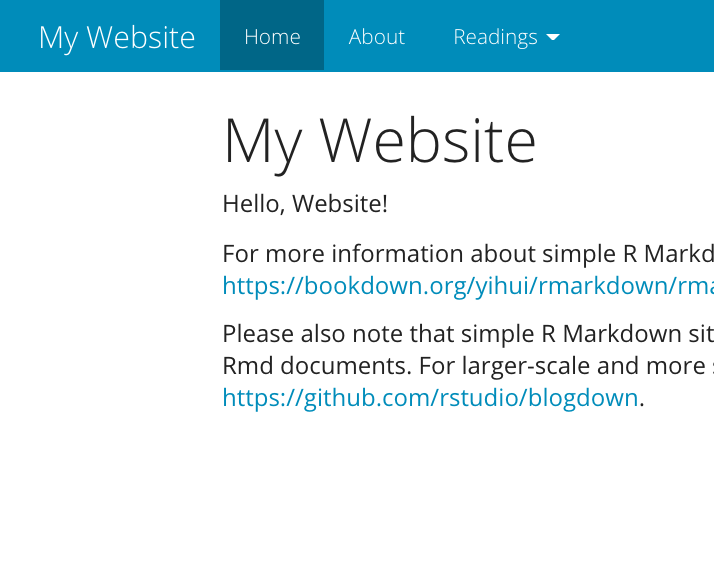
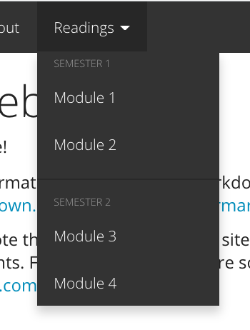

# Dress it up! {#rmd-dress}


The focus of this section is to show you "built in" ways for you to change the way your site looks and feels *without needing any custom style*. What does this mean? This means you don't need to know or use [CSS, otherwise known as Cascading Style Sheets](https://en.wikipedia.org/wiki/Cascading_Style_Sheets) to make any of the changes we demo below. 


## Before you begin

Let's return to our site, right where we left off. You should have already added your own content, but for simplicity, I'm going to continue with the boilerplate demo that we've been showing. Your content does not have to be the same as mine from this point forward.

The sections below go through a list of built-in ways you can give your site a face lift by editing the YAML. There are a lot but don't feel overwhelmed. Most of these options are à la carte -- so go ahead and scroll on down and see if there are any you like!


Let's try out some different options. Build your site or use `rmarkdown::render_site()` after trying each one out to see how the change affects your site.

If these customizations leave you wanting more, then be sure to check out the ["Make it fancier"](#rmd-fancy) chapter.


## One YAML to rule them all {#rmd-one-yaml}


We start off with a closer look at `_site.yml`. This file is like the orchestra conductor of our site.

The `_site.yml` file directs the R Markdown site generator how to build our *whole site* from the different sections <!--(think: cello, violins, bass)-->. The file is written in YAML (which in the programming world is just a language that is easy-ish to read and usually deals with configuation settings). `_site.yml` is not only what creates the navigation bar (a.k.a "navbar") for us, but it's also mission-control for layout and aesthetics options, as we'll see soon. 

<center>{width=90%}</center>

Normally a single R Markdown document will have its own YAML. When we make an R Markdown site, we have a new tool, the `_site.yml`, which is a global YAML file. This YAML acts as a default YAML setting for all the `.Rmd`s that will go into our website. This is useful if, for example, we want the table of contents to appear on every site page, but don't want to have to write it at the top every individual `.Rmd`. Just throw it in once to `_site.yml` and have all your YAML options apply globally.

**What happens if one of your R Markdown documents in your site still has its own YAML at the top?** Then the YAML options at the top of that R Markdown document will apply to that document only. An individual `.Rmd` file's YAML will override the global `_site.yml`. This can actually be useful when some options are only applicable to a single page on your site. For example, the `code_download` option, which we demo in the next section, might not be relevant for all your site pages, so you can reserve this for individual page YAMLs only. If an individual page's YAML and the `_site.yml` conflict, then the more specific option will always win (i.e. the individual YAML).

## Applying what you can from a single lesson

We won't cover it again here, but you should also add the following things that we already covered in the single Rmd lesson

* Floating TOC
* White Space

## Add a site theme {#rmd-site-theme}

Open your `_site.yml` file, and let's begin our site makeover. We'll start with setting up our `_site.yml` to apply a theme to our site. Themes are blanket ways of dressing up your site's aesthetics quickly. We highly recommend picking a theme for your site! You have 15 theme options: 

+ `default`, `bootstrap`, `cerulean`, `cosmo`, `darkly`, `flatly`, `journal`, `lumen`, `paper`, `readable`, `sandstone`, `simplex`, `spacelab`, `united`, and `yeti` (use `null` for no theme) 

You can preview them all [here](#rmd-themes).

Here is how you give your website a theme:

1. **Open** `_site.yml`.

2. **Add these 3 lines** to the bottom of your `_site.yml` file; let's give every page the same `theme = "yeti"` *(Remember! Indentation and new lines matter very much here)*:

```yaml
output:
  html_document:
    theme: yeti
```

\

Save your `_site.yml` file then re-build your site. Your YAML should like this, and your site should now be themed.

<div class = side-by-side>
<div class = side1>

```yaml
name: my-website
output_dir: docs
navbar:
  title: My Website
  left:
  - text: Home
    href: index.html
  - text: About
    href: about.html
  - text: Readings
    menu:
    - text: Module 1
      href: readings-module1.html
    - text: Module 2
      href: readings-module2.html
    - text: Module 3
      href: readings-module3.html
    - text: Module 4
      href: readings-module4.html
output:
  html_document:
    theme: yeti
```
</div>

<div class= side2>

<div class="figure" style="text-align: center">

<p class="caption">(\#fig:yeti-closeup)Add a site theme</p>
</div>


</div>
</div>

\

:::gotcha

Within any YAML, pay careful attention to the indentations and spaces. YAMLs are fussy about this, and this is often the source of many errors!
:::


\


## Customize code highlighting {#rmd-highlight}

Now that we have a theme, we may also want to change how our code looks. Again, we have a few built-in options:

+ `default`, `tango`, `pygments`, `kate`, `monochrome`, `espresso`, `zenburn`, `haddock`, and `breezedark`

Check out what these look like [here](https://www.garrickadenbuie.com/blog/pandoc-syntax-highlighting-examples/). 

Add a highlight style by creating one new line with the key `highlight`, nested underneath the `html_document:` line:

<div class = side-by-side>
<div class = side1>

```yaml
name: my-website
output_dir: docs
navbar:
  title: My Website
  left:
  - text: Home
    href: index.html
  - text: About
    href: about.html
  - text: Readings
    menu:
    - text: Module 1
      href: readings-module1.html
    - text: Module 2
      href: readings-module2.html
    - text: Module 3
      href: readings-module3.html
    - text: Module 4
      href: readings-module4.html
output:
  html_document:
    theme: yeti
    highlight: tango
```
</div>

<div class= side2>


</div>
</div>


## Change the navbar color {#rmd-navbar}

Each [site "theme"](#rmd-site-theme) has a built-in color for the navigation bar, but there is also an alternate navigation bar color we can activate by swapping out the theme `type` from default to inverse. This means that each site theme can really generate two distinct "looks".

<div class = side-by-side>
<div class = side1>

```yaml
name: my-website
output_dir: docs
navbar:
  title: My Website
  type: inverse
```

</div>

<div class= side2>



</div>
</div>

See Figure \@ref(fig:yeti-closeup) for a reminder of what the default navbar color looked like. For the next few examples, we'll stick to using the default.

## Add navbar icons {#rmd-icons}

In [Caring for your site](#rmd-care), we saw how to [add new pages](#add-rmd) and [grow your navbar](#rmd-grow). When you add `text` and `href` fields to your navbar, you can also add sprinkle in an `icon: <icon-prefix-and-name>` either in addition to or in place of text. Using icons in place of text is often used to provide links to outside sources (e.g., Slack, GitHub, etc.) or to other pages within your own site. You can use any* icons from [Font Awesome](https://fontawesome.com/icons), by entering the prefix `fa-` followed by the icon's name. 


:::gotcha

Well, you can't really use *any* font awesome icon. It has to be a font awesome icon from a version that R Markdown has loaded. At the time of writing this means only using icons that are from version....

:::

<div class = side-by-side>
<div class = side1>

Here is a basic navbar:

```yaml
navbar:
  left:
  - text: Home
    href: index.html
  - text: About
    href: about.html
```

</div>

<div class = side2>

And here is the same with icons added:

```yaml
navbar:
  left:
  - text: Home
    href: index.html
    icon: fa-home
  - text: About
    href: about.html
    icon: fa-book-open
  right:
  - href: https://github.com/rstudio4edu
    icon: fa-github
  - href: https://twitter.com/rstudio
    icon: fa-twitter
```

</div>
</div>


\

Here is the output:

\


<div class = side-by-side>
<div class = side1>

Left navbar

<!--todo--- {width=100%} --->

</div>

<div class= side2>
Right navbar

{width=100%}
</div>
</div>


## Tidy up the dropdown menu {#rmd-tidy-menu}

There's a little more accessorizing we can do with the dropdown menu.

* **Add divider lines** to create sections in the dropdown with `- text: "---"`. 

* **Add internal headers** with a `- text:` line without an `href` line immediately underneath it. 


<div class = side-by-side>
<div class = side1>

```yaml
name: my-website
output_dir: docs
navbar:
  title: My Website
  type: default
  left:
  - text: Home
    href: index.html
  - text: About
    href: about.html
  - text: Readings
    menu:
    - text: Semester 1
    - text: Module 1
      href: readings-module1.html
    - text: Module 2
      href: readings-module2.html
    - text: '---------'
    - text: Semester 2
    - text: Module 3
      href: readings-module3.html
    - text: Module 4
      href: readings-module4.html
```

</div>

<div class= side2>


</div>
</div>


## Recap

* Theme
* Highlighting
* Inverse color navbar
* Icons
* Dropdown divider
