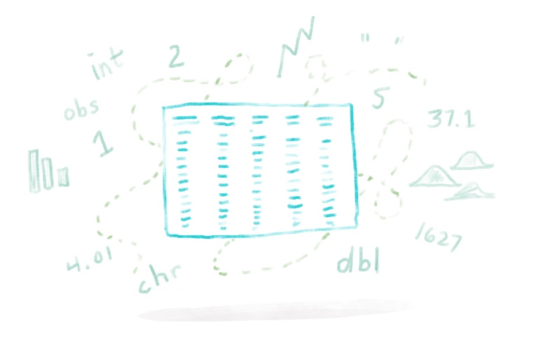

# Data {#data}

{width=60%}

## Data from R packages {#data-int}

good clean data packages, ideal for teaching beginner to intermediate

+ [fivethirtyeight](https://fivethirtyeight-r.netlify.com/)
+ gapminder
+ babynames
    + https://github.com/mine-cetinkaya-rundel/ukbabynames
    + https://docs.ropensci.org/ozbabynames/
+ not a package but https://github.com/rfordatascience/tidytuesday
+ for tidying: 
    + https://github.com/jennybc/lotr
    + Most raw data from gapminder: https://www.gapminder.org/data/
    + https://www.jvcasillas.com/untidydata/
+ https://simplystatistics.org/2018/01/22/the-dslabs-package-provides-datasets-for-teaching-data-science/
+ https://github.com/rstudio-education/dsbox
+ https://kieranhealy.org/blog/archives/2018/12/12/teaching-and-learning-materials-for-data-visualization/

+ [ISLR data](https://cran.r-project.org/package=ISLR)
+ [`resample` data](https://github.com/rudeboybert/resampledata)

## Data stored on GitHub {#data-github}

Tip: make a short link to the "raw" version of the data you uploaded to GitHub

## Data from other sources {#data-ext}

tips/tricks for logistics (use_course, etc)

see [data package](#data-pkg) for your own
