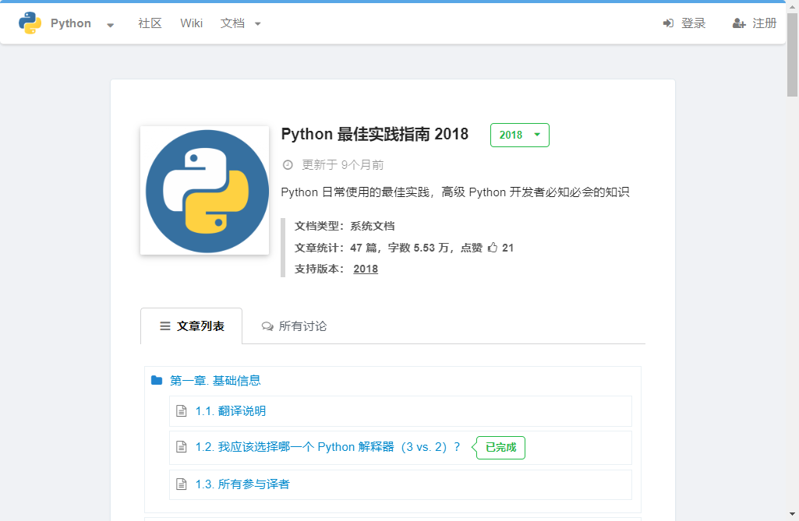

# (APPENDIX) Appendix {-}

# R programming

R is a popular programming language in biomedicine field. 

###  The coursera on R programming  

{width=70%}

- Lecturer: *Dr*. Roger D. Peng, Johns Hopkins University
- URL: [https://www.coursera.org/learn/r-programming](https://www.coursera.org/learn/r-programming)

###  Learn R on codecademy  

{width=70%}

- Lecturer: *Dr*. XX, XX University
- URL: [https://www.codecademy.com/learn/learn-r](https://www.codecademy.com/learn/learn-r)

###  Data Science: R Basics  

{width=70%}

- Lecturer: *Dr*. XX, XX University
- URL: [Data Science: R Basics](https://www.edx.org/course/data-science-r-basics?source=aw&awc=6798_1668191183_10d4db98964f4e5f819646ecb14b17ab&utm_source=aw&utm_medium=646197&utm_content=text-link&utm_term=646197_CodeSpaces)

###  Data Analysis with R 

{width=70%}

- Lecturer: *Dr*. XX, Duke University
- URL: [Data Analysis with R](https://www.coursera.org/specializations/statistics?irclickid=0iwUmb3yOxyNTz-SQH2S-VEXUkDSmuwcPXp8QI0&irgwc=1&utm_medium=partners&utm_source=impact&utm_campaign=3311133&utm_content=b2c)

# Python programming

Python is a popular programming language. 

###  Data Analysis with R 

{width=70%}

- Lecturer: *Dr*. XX, Duke University
- URL: [Python语言最佳实践](https://learnku.com/docs/python-guide/2018)

MY RED TEXT

# Rstudio course

# Docker course
